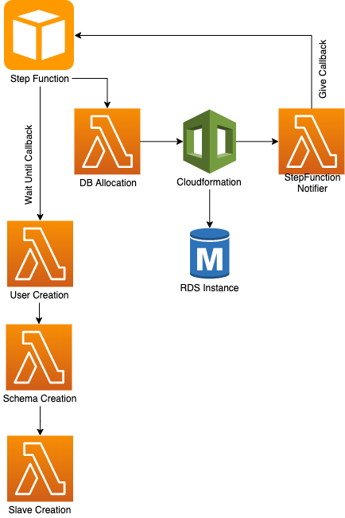

# AWS Stepfunction call back pattern using AWS Lambda

## Stack : Java, Stepfunctions, Lambda, RDS, Serverless Framework

This project demonstrates the implementation of callback pattern in AWS Stepfunctions with Lambda

AWS Step Function allows us to coordinates various components in AWS using visual workflows.

Make sure you experiment this under AWS free tier and delete the resources after you use it. Else you would be charged for the resource usage.
Also this project creates a slave instance for an RDS database. Doing this will exceed the free tier limit and it will cost you. Exclude the slave creation step if you want to avoid the costs.

This project is almost similar in use case with my other project https://github.com/epraveenns/AWS-CloudFormation-Lambda

**Build:**
- Install serverless framework using `npm install -g serverless`
- Switch to this project directory and do `mvn clean install`
- Run `serverless deploy` command. This will take care of launching all the lambda and the required permissions to run the lambda. See [serverless.yaml](serverless.yaml)
- Go to AWS Console > Create State Machine > Standard. Under definition, give the content as given in the file [StepFunction.json](src/resources/StepFunction,json). Skip the slave creation step if needed.
- Click Next
- Give a name for state machine and select 'create new role' under Permissions.

**Run:**
- Go to the newly created step function > Start Execution > Give input as given in the file [Input](src/resources/SampleStepfunctionInput.json)
- Click on Start Execution and workflow will start

Medium post link : https://medium.com/@epraveenns/aws-step-function-call-back-pattern-using-aws-lambda-569678b0e02c

Note : The RDS Database that will be created will have a default security group as we are not configuring any security group for it. That security group should be configured to allow incoming requests from Lambda or else Lambda cannot connect to the RDS instance.
This can be done either by allowing all traffic from any network into the security group (Not recommended for serious use cases) or else by configuring a VPC for lambda, RDS and Stepfunction which is not covered in this project.